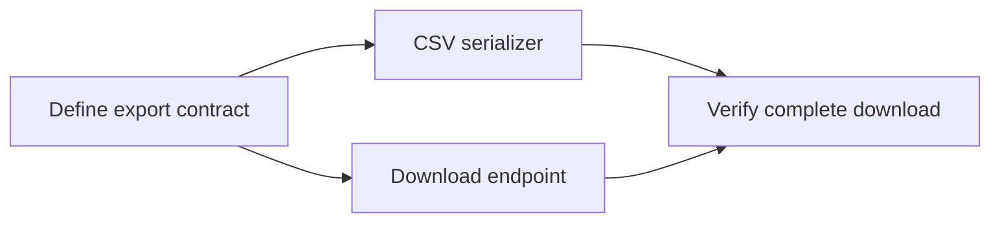

# Upstream workflow adoption

This work adapts selected upstream ideas to DMI's existing planning, TDD,
debugging, and review workflow. It does not replace the skill collection wholesale.

## Sources

Original repositories fetched on 2026-09-19; local HEAD and freshly fetched
`origin/main` matched in each checkout. All three default branches are `main`.

| Repository | Revision |
| --- | --- |
| [obra/superpowers](https://github.com/obra/superpowers) | `5bf4e78011075bcfc0dc295f0724994cd123ee71` (v6.4.1) |
| [mattpocock/skills](https://github.com/mattpocock/skills) | `c55ee46073ed923f86ce59a5eb3b6d895095d1b7` |
| [DietrichGebert/ponytail](https://github.com/DietrichGebert/ponytail) | `e3ba2aa6f1e6f0bc4d69eb09c9f0d0a93af56156` (v4.10.0) |

The comparison baseline is DMI `a293803`. Implementation and evaluation records
belong in `docs/evals/upstream-workflows/`. Model: GPT-6 in T3 Code through the
Codex harness; the T3 Code version is not exposed. Evaluation records disclose
their own runtime when a different harness is used.

## Changes on this branch

- Repair test discovery and reject review packages with invalid commit ranges.
- Give each plan its own workspace, identified by its canonical path.
- Scale planning to exploratory, bounded, and architectural work.
- Honor inline execution as a first-class choice, with durable progress and a
  final review; retain task-level review for subagent execution.
- Resume implementers for fixes, scope re-reviews to the fixes, and stop repeated
  unsuccessful review cycles without declaring unresolved defects complete.
- Require a prerequisite field on each task, including `None` on root tasks.

See the [evaluation record](evals/upstream-workflows/README.md) for before/after
results, regression guards, exact prompts, and grading caveats. Upstream results
motivate evaluation; they are not measurements of DMI's quality or token savings.

## Core coding-skill additions

The four additional skills were informed by current upstream repositories, then
rewritten for DMI's cross-harness vocabulary and evaluated against focused fixtures:

- Trail of Bits' [skills](https://github.com/trailofbits/skills) supplied the
  variant-analysis and property-testing concepts (repository license: CC BY-SA 4.0).
- Addy Osmani's [agent-skills](https://github.com/addyosmani/agent-skills) supplied
  source-driven development and safe-migration concepts (repository license: MIT).

No upstream file was copied verbatim. The skill text is original DMI wording, and
the evaluation record preserves baseline, candidate, grader prompts, hashes, and
adjudications for each skill in [core-skill-expansion](evals/core-skill-expansion/README.md).
Planning with Files, Graphify, and SkillOpt were deliberately not added. A future
LLM-wiki or graph/RAG implementation is a separate product design, not a standing
coding skill in this plugin.
The CSV fixture already elicited implied edge-case tests without new rules.
Ponytail's caller tracing and existing-helper reuse also passed without additions;
one raw grader failure confused answer prose with a source-code comment.
Neither result justifies adding standing instructions for the same behavior.
The retrospective fixture likewise produced the proposed executable checks and
review simplification without a new skill. Raw inspection-related grader failures
are retained with their adjudication: workers had supplied configuration and
were explicitly instructed not to use tools. No retrospective skill was added.

## What a task graph adds

A task graph records which deliverables must exist before another task can start.
Each task is a node; a `Blocked by` entry is an edge from a prerequisite to that
task. The ready **frontier** consists of unfinished tasks whose prerequisites
have passed their completion gates.

For a CSV export feature:

The contract unlocks the serializer and endpoint. Download verification waits
for both. If the serializer fails review, download verification remains blocked.
After a session resumes, the ledger reconstructs this frontier instead of relying
on remembered task numbers.

The graph is a planning aid even with one worker. It makes dependencies explicit,
exposes cycles, supports narrow task briefs, and prevents a task from being
treated as complete merely because a later task number was reached. Dependencies
include semantic contracts and shared state, not only file overlap.

## Three different graphs

| Graph | Nodes and edges | Suitable use |
| --- | --- | --- |
| Decision map | Open questions and the decisions that unblock them | Multi-session exploration before the implementation plan is knowable |
| Task graph | Testable deliverables and their prerequisites | Executing an agreed plan and recovering after interruption |
| Code dependency graph | Modules and their imports or calls | Architecture analysis and change-impact analysis |

Matt Pocock's `wayfinder` is a decision map; `to-tickets` creates a task graph.
His experimental `implement-spec` adds concurrent worktrees and integration.
None is a general codebase knowledge-graph service.

DMI's first adoption is explicit task dependencies in its existing TSP format.
The agent interprets those fields and the progress ledger; this branch does not
add a graph database, automatic cycle checker, or scheduler. It keeps sequential
implementation. An edge-free pair is not sufficient proof
that concurrent implementation is safe: workers can still disagree about a
shared interface. A future parallel executor needs isolated worktrees, ownership
and merge rules, integration tests, failure propagation, and comparative evals.

For large migrations, use expand–migrate–contract: introduce a compatible new
interface, migrate consumers in independently verifiable batches, then remove
the old interface after every consumer has moved. Each batch depends on the
expansion; contraction depends on every batch.

## Adoption boundaries

- Keep DMI's deep-module exception, behavioral testing, artifact-specific
  verification, and evidence-gated skill authoring.
- Do not use a retry cap as permission to ship a known correctness defect.
- Keep exploratory probes distinct from production implementation.
- Do not add automatic issue creation, remote publication, or endless agent loops.
- Matt's `loop-me` designs recurring workflows; it is not a coding-loop executor
  and is outside this change.
- No retrospective skill is installed by this change; the evaluated behavior
  did not establish a need for additional standing instructions.

Working-tree skill simulations do not prove installed triggering or cross-harness
runtime behavior. Live verification after reinstall remains a separate check.
