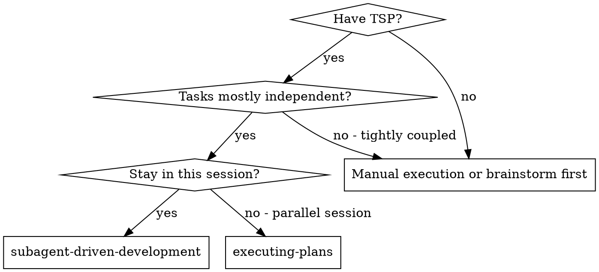
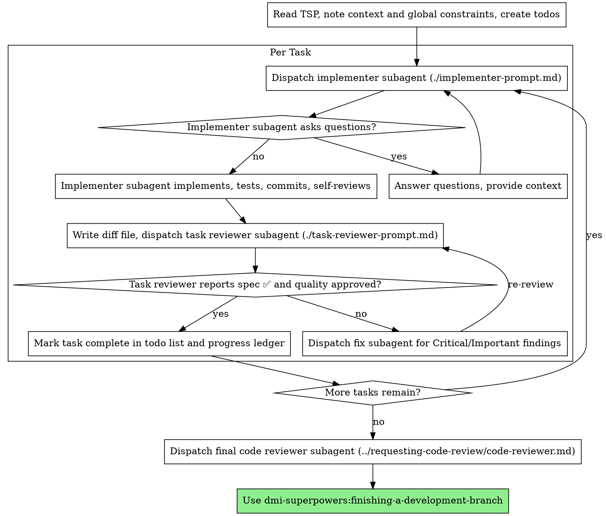

# Subagent-Driven Development — Reference

Deferrable detail relocated from [SKILL.md](SKILL.md): diagrams, worked example, rationale, and secondary guidance. SKILL.md carries every enforced rule; this file elaborates.

## Contents

- [Narration](#narration)
- [When to Use](#when-to-use)
- [The Process](#the-process)
- [Pre-Flight TSP Review](#pre-flight-tsp-review)
- [Model Selection](#model-selection)
- [DONE_WITH_CONCERNS](#done_with_concerns)
- [Global-constraints block](#global-constraints-block)
- [One fix subagent, not one per finding](#one-fix-subagent-not-one-per-finding)
- [File Handoffs rationale](#file-handoffs-rationale)
- [Report file / reviewer-inputs bullets](#report-file--reviewer-inputs-bullets)
- [Example Workflow](#example-workflow)
- [Advantages](#advantages)
- [Integration](#integration)

### Narration

**Narration:** between tool calls, narrate at most one short line — the
ledger and the tool results carry the record.

## When to Use



**vs. Executing Plans (parallel session):**
- Same session (no context switch)
- Fresh subagent per task (no context pollution)
- Review after each task (spec compliance + code quality), broad review at the end
- Faster iteration (no human-in-loop between tasks)

## The Process



## Pre-Flight TSP Review

Before dispatching Task 1, scan the TSP once for conflicts:

- tasks that contradict each other or the TSP's Global Constraints
- anything the TSP explicitly mandates that the review rubric treats as a
  defect (a test that asserts nothing, verbatim duplication of a logic block)

Present everything you find to your human partner as one batched question —
each finding beside the TSP text that mandates it, asking which governs —
before execution begins, not one interrupt per discovery mid-TSP. If the
scan is clean, proceed without comment. The review loop remains the net for
conflicts that only emerge from implementation.

## Model Selection

Use the least powerful model that can handle each role to conserve cost and increase speed.

**Mechanical implementation tasks** (isolated functions, clear specs, 1-2 files): use a fast, cheap model. Most implementation tasks are mechanical when the TSP is well-specified.

**Integration and judgment tasks** (multi-file coordination, pattern matching, debugging): use a standard model.

**Architecture and design tasks**: use the most capable available model.
The final whole-branch review is one of these — dispatch it on the most
capable available model, not the session default.

**Review tasks**: choose the model with the same judgment, scaled to the
diff's size, complexity, and risk. A small mechanical diff does not need the
most capable model; a subtle concurrency change does.

**Always specify the model explicitly when dispatching a subagent.** An
omitted model inherits your session's model — often the most capable and
most expensive — which silently defeats this section.

**Turn count beats token price.** Wall-clock and context cost scale with how
many turns a subagent takes, and the cheapest models routinely take 2-3× the
turns on multi-step work — costing more overall. Use a mid-tier model as the
floor for reviewers and for implementers working from prose descriptions.
When the task's TSP text contains the complete code to write, the
implementation is transcription plus testing: use the cheapest tier for
that implementer. Single-file mechanical fixes also take the cheapest tier.

**Task complexity signals (implementation tasks):**
- Touches 1-2 files with a complete spec → cheap model
- Touches multiple files with integration concerns → standard model
- Requires design judgment or broad codebase understanding → most capable model

### DONE_WITH_CONCERNS

**DONE_WITH_CONCERNS:** The implementer completed the work but flagged doubts. Read the concerns before proceeding. If the concerns are about correctness or scope, address them before review. If they're observations (e.g., "this file is getting large"), note them and proceed to review.

### Global-constraints block

- The global-constraints block you hand the reviewer is its attention
  lens. Copy the binding requirements verbatim from the TSP's Global
  Constraints section or the PRD: exact values, exact formats, and the
  stated relationships between components ("same layout as X", "matches
  Y"). The reviewer's template already carries the process rules (YAGNI,
  test hygiene, review method) — the constraints block is for what THIS
  project's PRD demands.

### One fix subagent, not one per finding

- If the final whole-branch review returns findings, dispatch ONE fix
  subagent with the complete findings list — not one fixer per finding.
  Per-finding fixers each rebuild context and re-run suites; a real
  session's final-review fix wave cost more than all its tasks combined.

### File Handoffs rationale

Everything you paste into a dispatch prompt — and everything a subagent
prints back — stays resident in your context for the rest of the session
and is re-read on every later turn.

### Report file / reviewer-inputs bullets

- **Report file:** name the implementer's report file after the brief
  (brief `…/task-N-brief.md` → report `…/task-N-report.md`) and put it in
  the dispatch prompt. The implementer writes the full report there and
  returns only status, commits, a one-line test summary, and concerns.
- **Reviewer inputs:** the task reviewer gets three paths — the same brief
  file, the report file, and the review package — plus the global
  constraints that bind the task.
- Fix dispatches append their fix report (with test results) to the same
  report file and return a short summary; re-reviews read the updated file.

## Example Workflow

```
You: I'm using Subagent-Driven Development to execute this TSP.

[Read TSP file once: docs/TSPs/feature-plan.md]
[Create todos for all tasks]

Task 1: Hook installation script

[Run task-brief for Task 1; dispatch implementer with brief + report paths + context]

Implementer: "Before I begin - should the hook be installed at user or system level?"

You: "User level (~/.config/superpowers/hooks/)"

Implementer: "Got it. Implementing now..."
[Later] Implementer:
  - Implemented install-hook command
  - Added tests, 5/5 passing
  - Self-review: Found I missed --force flag, added it
  - Committed

[Run review-package, dispatch task reviewer with the printed path]
Task reviewer: Spec ✅ - all requirements met, nothing extra.
  Strengths: Good test coverage, clean. Issues: None. Task quality: Approved.

[Mark Task 1 complete]

Task 2: Recovery modes

[Run task-brief for Task 2; dispatch implementer with brief + report paths + context]

Implementer: [No questions, proceeds]
Implementer:
  - Added verify/repair modes
  - 8/8 tests passing
  - Self-review: All good
  - Committed

[Run review-package, dispatch task reviewer with the printed path]
Task reviewer: Spec ❌:
  - Missing: Progress reporting (TSP says "report every 100 items")
  - Extra: Added --json flag (not requested)
  Issues (Important): Magic number (100)

[Dispatch fix subagent with all findings]
Fixer: Removed --json flag, added progress reporting, extracted PROGRESS_INTERVAL constant

[Task reviewer reviews again]
Task reviewer: Spec ✅. Task quality: Approved.

[Mark Task 2 complete]

...

[After all tasks]
[Dispatch final code-reviewer]
Final reviewer: All requirements met, ready to merge

Done!
```

## Advantages

**vs. Manual execution:**
- Subagents follow TDD naturally
- Fresh context per task (no confusion)
- Parallel-safe (subagents don't interfere)
- Subagent can ask questions (before AND during work)

**vs. Executing Plans:**
- Same session (no handoff)
- Continuous progress (no waiting)
- Review checkpoints automatic

**Efficiency gains:**
- Controller curates exactly what context is needed; bulk artifacts move
  as files, not pasted text
- Subagent gets complete information upfront
- Questions surfaced before work begins (not after)

**Quality gates:**
- Self-review catches issues before handoff
- Task review carries two verdicts: spec compliance and code quality
- Review loops ensure fixes actually work
- Spec compliance prevents over/under-building
- Code quality ensures implementation is well-built

**Cost:**
- More subagent invocations (implementer + reviewer per task)
- Controller does more prep work (extracting all tasks upfront)
- Review loops add iterations
- But catches issues early (cheaper than debugging later)

## Integration

**Required workflow skills:**
- **dmi-superpowers:using-git-worktrees** - Ensures isolated workspace (creates one or verifies existing)
- **dmi-superpowers:writing-plans** - Creates the TSP this skill executes
- **dmi-superpowers:requesting-code-review** - Code review template for the final whole-branch review
- **dmi-superpowers:finishing-a-development-branch** - Complete development after all tasks

**Subagents should use:**
- **dmi-superpowers:test-driven-development** - Subagents follow TDD for each task

**Alternative workflow:**
- **dmi-superpowers:executing-plans** - Use for parallel session instead of same-session execution
